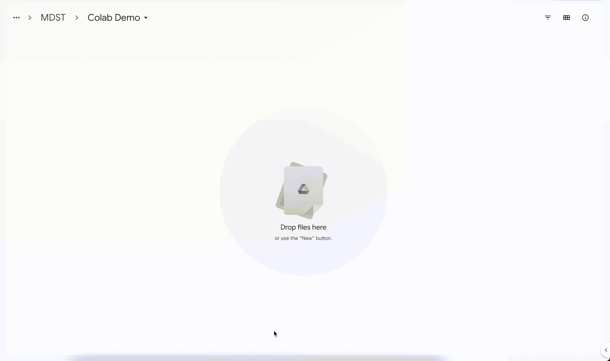
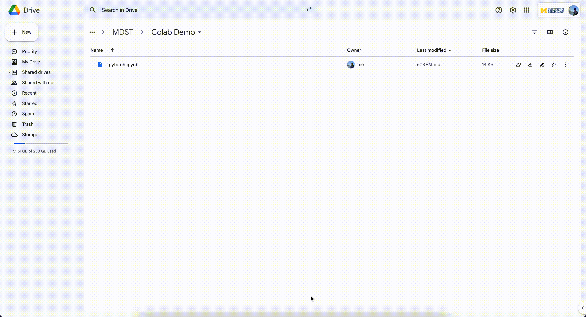
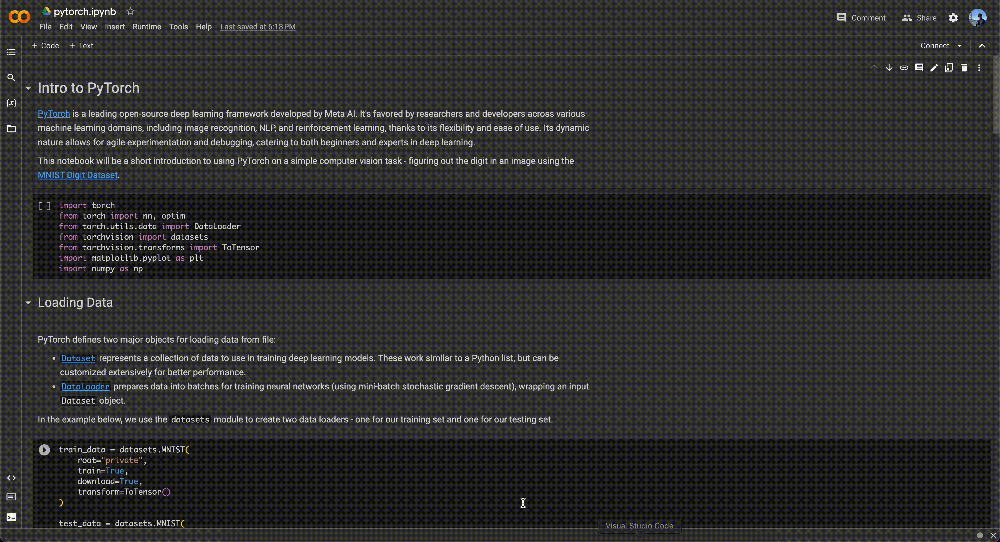

# RvF - Classifying Real vs Fake Faces

Deepfakes are everywhere now, and like us you're probably wondering ["wow how am I really going to figure out if that video of Morgan Freeman telling me he isn't real, is actually real?"](https://youtu.be/oxXpB9pSETo). While a true deepfake detector is too complicated for a single semester, we're going to do something a little bit easier - try and determine whether a picture of a face is fake or not. You'll definitely enjoy this project if you want to learn about neural networks, computer vision, and figuring out if your friend keeps Photoshopping their Instagram posts.

**Skills Learned**: Deep Learning, Computer Vision, PyTorch, TensorFlow

## Timeline

| Date       | Topic                                           | Submission         |
| ---------- | ----------------------------------------------- | ------------------ |
| 9/17/2023  | Intro to Neural Nets + PyTorch                  | `pytorch` tutorial |
| 9/24/2023  | CNN Practice                                    | `cnn` tutorial     |
| 10/1/2023  | Team Assignments + Data Augmentation            |                    |
| 10/8/2023  | Data Augmentation + Intro to Model Architecture |                    |
| 10/15/2023 | **Fall Break**                                  |                    |
| 10/22/2023 | Model Architecture + Training                   |                    |
| 10/29/2023 | Model Development!                              |                    |
| 11/5/2023  | Model Development + Presentation Prep!          |                    |
| 11/12/2023 | Presentation Prep                               |                    |
| 11/19/2023 | **Project Expo 🎉**                             |                    |

## How to use this repo

This repo is the homebase for this project, originally run in the Fall 2023 semester by MDST. Here you can find all of the notebooks we used, along with the work done by our members.

Below is our folder structure for this project:

```
.
├── README.md // this file!
├── media // folder
├── notebooks // folder for all tutorials and guides
│   └── pytorch.ipynb
└── team_folders // folders for work done by each team
```

## Using Google Colab

We will be using Google Colabatory to run Python notebooks for this project. Google colabatory is an online cloud IDE developed by Google to run Python notebooks in a controlled execution environment requiring minimal setup.

Here is an example of how to upload and run code on Google Colab:

1. **Upload .ipynb file to Google Drive** - You can download the .ipynb notebook from GitHub and upload it to a folder in Google Drive.
   
2. **Open the notebook in Google Colab** - this can be as simple as double clicking on the file! If this doesn't work, you may need to right click the file, click the "Connect more apps" button, and add "Google Colabatory".
   
3. **Click Connect to start!** - This tells Colab to connect to Google servers and create a virtual workspace. You can then start running cells and executing Python code!
   

## Other Resources
- **PyTorch Documentation** - [https://pytorch.org/docs/stable/index.html](https://pytorch.org/docs/stable/index.html)
- **PyTorch Basic Tutorial** - [https://pytorch.org/tutorials/beginner/basics/intro.html](https://pytorch.org/tutorials/beginner/basics/intro.html)
- **Neural Network Introduction** - [https://cs231n.github.io/neural-networks-1/](https://cs231n.github.io/neural-networks-1/)
- **All About Convolutional Neural Networks** - [https://cs231n.github.io/convolutional-networks/](https://cs231n.github.io/convolutional-networks/)
- **Example CNN** - https://www.kaggle.com/code/akassshhhh/challenging-fake-image-detection

**Fun fact!** One of the instructors who helped contribute to the latter two resources used to teach at U-M (they taught EECS 442 + some upper level special topics classes)!
